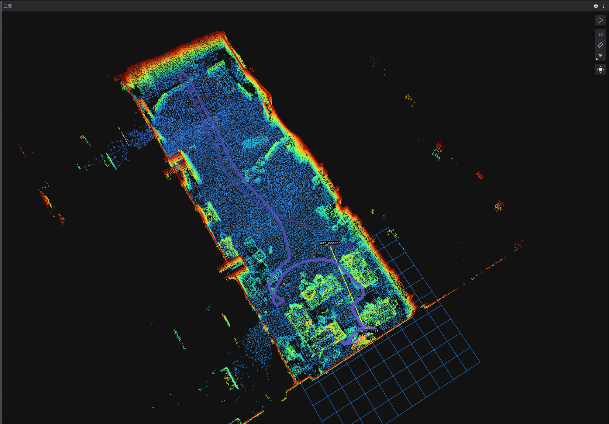

# Hello World 视觉组纳新大作业 - 实时定位设计

## 环境配置：

Ubuntu 22.04 + ROS2 humble

## 项目说明

本项目要求实现一个基于激光雷达与IMU的实时定位与里程计系统。

### 项目结构

-   `record.sh`：录包脚本，用于录制测试数据。
-   `replay.sh`：回放脚本，用于回放测试数据进行测试。

由于该项目任务规模较大且难以分割，通常依赖开源SLAM仓库进行设计，且各开源方案结构完善且差异较大，因此不提供基本框架。

### 任务描述

你需要完成以下四个任务：

1. **构建点云地图**：利用各类`LIO`算法，对`bag/easy`中的数据构建点云地图。

2. **获取初始位姿**：手动或自动地获取机体的初始位姿，以保证定位的准确性。

3. **获取实时定位**：利用里程计或高性能定位算法，获取机体实时定位与轨迹。

4. **应对突发事件**：应对碰撞与起伏路段等突发事件，保证定位鲁棒或发散后重定位。

该任务不限制你对任何开源仓库的使用，但是你需要保证你的代码运行后发布如下几个话题：

1. 一个`sensor_msgs::msg::PointCloud2`类型的`/static_pointcloud_map`话题，它定时发布你构建的点云地图，坐标系应为`map`，为了保证可视化效果，在发布时你应当**过滤`z>1.5`的所有点**（把天花板掀掉）。
   
2. 一个`nav_msgs::msg::Path`类型的`/path`话题，它发布自里程计运行开始的实时历史路径。

当在`rviz2`或`foxglove`订阅如上两个话题，并将坐标系定为`map`后，其应当呈现出如下效果图，你也可以在`example.webm`中查看录屏效果：

### 数据包描述

数据包分为四档难度,录制了`览沃livox MID360`激光雷达的雷达消息`/livox/lidar`，IMU消息`/livox/imu`与点云消息`/livox/lidar/pointcloud`，具体构建方式如下：

- `bag/easy`：激光雷达缓慢平滑移动，包括对角落细节的详细扫描，**你只允许使用该数据包建图**，这也意味着一般而言，该数据包的起点为构建地图的坐标系原点。
  
- `bag/normal`：激光雷达移动略微迅速，轨迹相对复杂，起始原点位置与`easy`不同，姿态与`easy`相同。
  
- `bag/hard`：激光雷达移动较为迅速，轨迹相对复杂，起始原点位置姿态均与`easy`不同，运行过程中存在`x,y,z`三个方向的模拟碰撞（即短时间加速度计饱和）。
  
- `bag/lunatic`：激光雷达移动迅速，轨迹复杂，起始原点位置姿态均与`easy`不同，运行过程中存在`x,y,z`三个方向的模拟碰撞（即短时间加速度计饱和），以及起伏路段（姿态快速剧烈变化）。

使用时，解压`bag.7z`至`{workspace}`，修改`replay.sh`对应`BAG_NAME`，随后执行`bash replay.sh`即可。

## 其他说明

1. 请保证良好的代码风格与项目管理习惯，你可以使用git管理你的仓库。尽管本项目你可能需要组合多个开源仓库，请尽可能保证你的仓库结构调理清晰。
   
2. 提交的项目应当附加一个完善的说明文档，描述各任务完成的思路、算法流程与实现细节，以及环境配置与运行指南。因此，建议在开发过程中进行记录与整理。

> [!TIP]
> 1. 一般而言，建图与里程计是相同的任务，可以参考FAST-LIO，LIO-SAM，POINT-LIO等开源仓库，对比不同仓库的建图与里程计效果。
> 
> 2. 初始位姿的获取一般需要两步：点云粗匹配与点云精匹配；前者用于获取雷达点云与点云地图的粗糙匹配位姿（所有录制点云开头均静止若干秒供你手动粗匹配，但是更鼓励自动粗匹配算法），后者用于提高初始位姿精度。
> 
> 3. 对于碰撞与起伏路段这类突发事件的处理，可以分为两种方向：一、提高里程计鲁棒性保证不会发散；二、在里程计发散之后判断失效并重新自动获取定位。
>
> 4. 当缺乏思路或遇到特定困难无法解决时，你可以多借鉴开源项目。[RoboMaster开源论坛](https://bbs.robomaster.com/)。